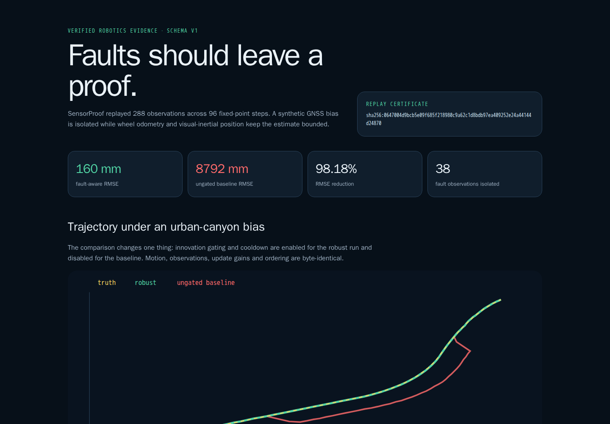
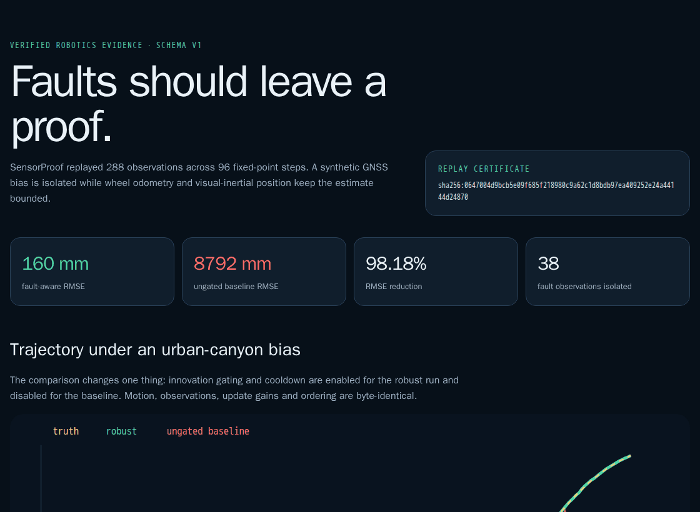
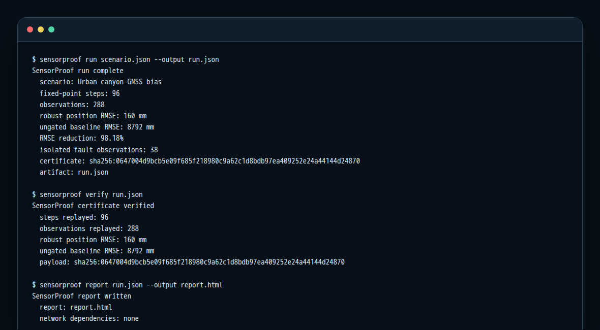
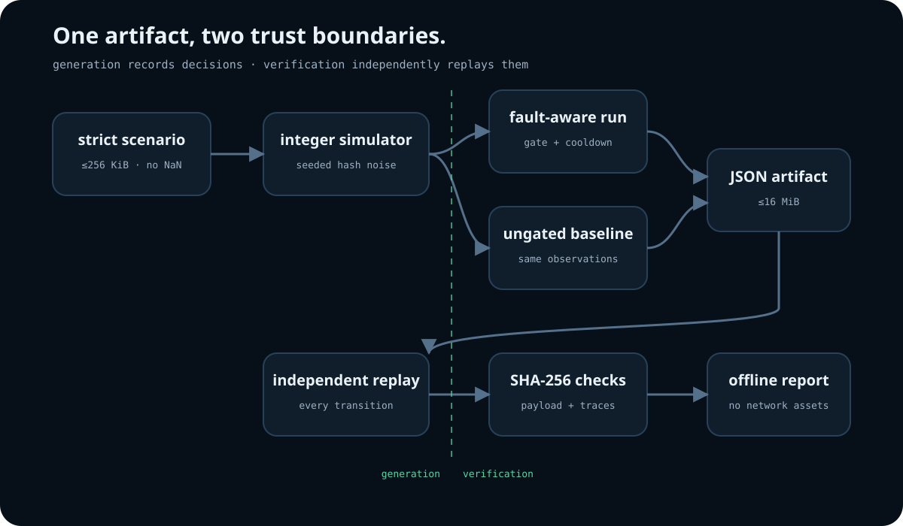
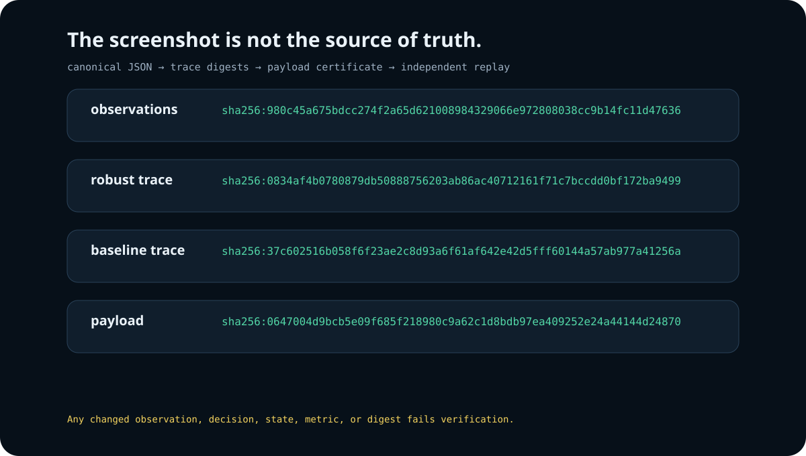

# SensorProof

Deterministic fault-aware sensor fusion with independently replayable decision certificates.

[](https://github.com/omar07ibrahim/sensorproof/actions/workflows/ci.yml)
[](https://github.com/omar07ibrahim/sensorproof/actions/workflows/evidence.yml)
[](https://www.python.org/)
[](LICENSE)

SensorProof is a small robotics reliability lab: it simulates a moving platform, injects an abrupt GNSS bias, runs fault-aware and ungated estimators over the exact same observations, and emits a JSON artifact whose every transition can be replayed. The application has no third-party runtime dependency and uses integer millimetres throughout the experiment.

<p align="center">
  
</p>

The checked-in scenario produces **160 mm** fault-aware position RMSE versus **8,792 mm** for the identical ungated baseline: a **98.18% reduction**. All **38/38 fault-labelled GNSS observations** are rejected or quarantined; **2/250 healthy observations** are non-accepted. These are deterministic results for the included synthetic scenario, not a real-vehicle benchmark.

## See the whole run

<p align="center">
  
</p>

Every visual in this README comes from the checked-in scenario and artifact. The permanent evidence workflow regenerates the CLI transcript, JSON, HTML, four SVGs, four PNGs, and GIF inside a digest-pinned, networkless Chromium container, then compares every byte with the repository.

- [Full 1,440 × 3,998 report capture](docs/evidence/sensorproof-report-full.png)
- [Mobile 390 × 844 capture](docs/evidence/sensorproof-report-mobile.png)
- [Evidence manifest with source and file hashes](docs/evidence/sensorproof-evidence.json)
- [Reproducibility method](docs/evidence.md)

## What it demonstrates

| Capability | Concrete implementation |
| --- | --- |
| State estimation | Fixed-point `[x, y, vx, vy]` predictor plus position/velocity alpha-beta updates |
| Fault isolation | Two-strike normalized innovation gate with a bounded three-step quarantine |
| Controlled comparison | Robust and baseline runs share truth, noise, observations, gains, order, and initial state |
| Determinism | SHA-256-derived bounded noise, explicit half-away-from-zero rounding, no floating-point state |
| Auditability | Residual, gate, before/after state, health state, and decision recorded per observation |
| Independent verification | A separate replay path reconstructs every transition, summary, and digest |
| Input hardening | Strict UTF-8/JSON, duplicate-key and non-finite rejection, exact keys, bounded sizes and counts |
| Portable evidence | Self-contained offline HTML/SVG; no telemetry, model endpoint, dataset, or CDN |

<p align="center">
  
</p>

<p align="center">
  
</p>

## Quick start

SensorProof supports CPython **3.11.15, 3.12.13, 3.13.14, and 3.14.6** in CI.

```bash
git clone https://github.com/omar07ibrahim/sensorproof.git
cd sensorproof
python3.14 -m venv .venv
. .venv/bin/activate
python -m pip install --no-deps .
```

Run, verify, inspect, and render the included scenario:

```bash
sensorproof run scenarios/urban-canyon.json --output run.json
sensorproof verify run.json
sensorproof inspect run.json --step 34 --sensor gnss
sensorproof report run.json --output report.html
```

The report is a self-contained file; opening it does not contact a network service.

<p align="center">
  
</p>

## Workflow

<p align="center">
  
</p>

1. The strict parser accepts at most 256 KiB, 2,000 steps, 16 sensors, and 64 faults.
2. The simulator advances integer truth and produces deterministic hash-derived measurement noise.
3. The engine consumes each observation twice: once with gating and cooldown, once without either.
4. The artifact stores observations, both traces, summaries, scenario digest, and four SHA-256 digests.
5. The verifier regenerates observations and independently reconstructs every prediction, residual, decision, update, error, summary, and certificate.
6. The report renderer runs only after verification succeeds.

The algorithm and trust boundaries are detailed in [Architecture](docs/architecture.md). The exact experiment contract is in [Scenario and claims](docs/scenario.md).

## Why a certificate instead of a screenshot

A screenshot is presentation, not proof. SensorProof hashes canonical observations, both decision traces, and the complete payload. Changing one integer in an observation, residual, state, status, metric, or digest makes verification fail.

<p align="center">
  
</p>

The verifier is intentionally separate from the generation entry point. It does not trust recorded residuals, state updates, health counters, summaries, or comparison labels; it derives them again from the validated scenario and observations.

## Development

Install the exact hash-locked quality environment:

```bash
python -m pip install --no-deps --require-hashes -r requirements/quality.txt
python -m pip install --no-build-isolation --no-deps -e .
python -m ruff check .
python -m ruff format --check .
python -m mypy
python -m pytest -q --cov=sensorproof --cov-report=term-missing
```

The current suite contains 37 tests and enforces at least 90% line coverage (the release evidence run records 94%). CI also builds a wheel, inspects its file surface, installs it into a clean environment outside the checkout, and exercises the installed CLI.

## Scope and limitations

SensorProof v0.1.0 is a deterministic portfolio/research system, **not** a safety-certified localization stack.

- The evidence covers one abrupt synthetic GNSS bias-step. It does not claim detection of slow ramp attacks, correlated multi-sensor failures, dropouts, time-sync errors, or adversarial sensor spoofing.
- The fixed gains and integer gate make behavior inspectable; they are not a covariance-calibrated Kalman or factor-graph estimator.
- There are no ROS, CAN, hardware, or live-stream adapters in this release.
- The synthetic error values are not accuracy claims for a specific sensor, vehicle, city, or deployment.
- Never place this code in a control loop or safety decision without domain validation, calibrated models, hardware-in-the-loop testing, and independent review.

See [Security](SECURITY.md) for reporting and operational boundaries.

## Repository map

```text
src/sensorproof/          strict parser, simulator, engine, verifier, report, CLI
scenarios/                bounded reproducible experiment inputs
tests/                    contracts, adversarial tampering, CLI and report tests
tools/capture_evidence.py source-bound evidence generator and validator
docs/evidence/            real artifact, transcript, HTML, SVG, PNG, GIF, manifest
.github/workflows/        compatibility, wheel, quality, and visual-drift gates
```

## License

Apache-2.0. See [LICENSE](LICENSE).
