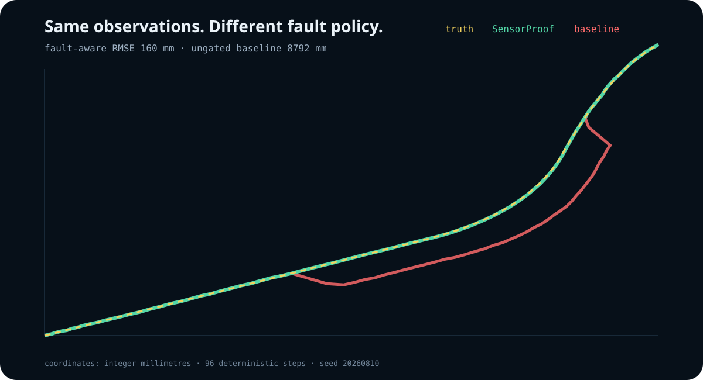
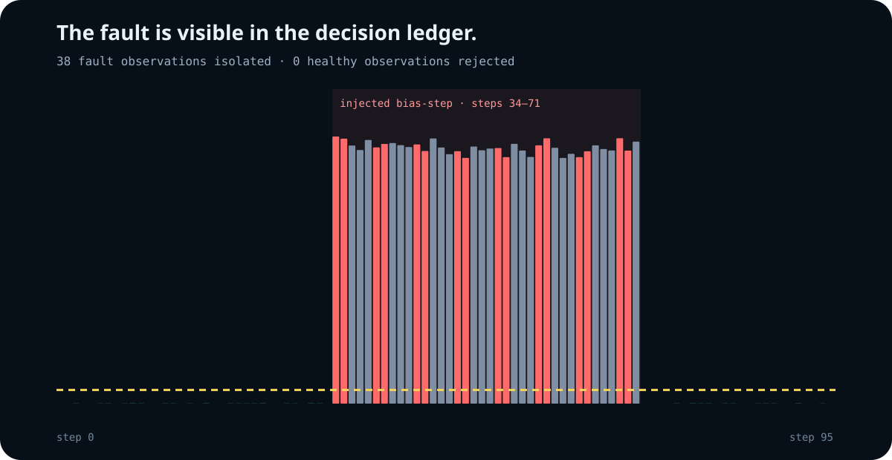

# Scenario and claims

The checked-in `urban-canyon.json` scenario is a deterministic synthetic counterfactual for one question:

> What changes when innovation gating and sensor quarantine are enabled while every observation, update gain, ordering decision, and initial condition remains identical?

## Configuration

| Parameter | Value |
| --- | --- |
| Steps | 96 |
| Timestep | 1,000 ms |
| Seed | 20,260,810 |
| State units | millimetres and millimetres/second |
| Sensors | wheel velocity, VIO position, GNSS position |
| Fault | GNSS `bias_step` |
| Fault interval | steps 34–71 inclusive |
| Injected bias | +16,000 mm x, −11,000 mm y |
| Robust health policy | reject above gate; quarantine 3 observations after 2 consecutive rejects |

Motion has four piecewise-constant acceleration segments. Measurement noise is deterministic and bounded by each sensor's configured `noise_units`; it is not sampled from a fitted field distribution.

## Exact result

| Metric | Fault-aware | Ungated baseline |
| --- | ---: | ---: |
| Position RMSE | **160 mm** | **8,792 mm** |
| Fault-labelled observations non-accepted | **38 / 38** | 0 / 38 |
| Healthy observations non-accepted | **2 / 250** | 0 / 250 |

The integer reduction recorded in the artifact is 9,818 basis points, displayed as **98.18%**.

## Claim boundary

This result is exactly reproducible for the included scenario and engine version. It is not:

- a benchmark over routes, cities, weather, hardware, or public datasets;
- evidence of centimetre-level real-world localization;
- a comparison with EKF, UKF, factor-graph, learned, or commercial systems;
- evidence against slow-ramp or coordinated multi-sensor attacks;
- a safety case for autonomous control.

The initial ramp-shaped scenario used during development exposed a real weakness of a plain absolute gate: a gradual bias could drag the estimate before isolation. The release therefore narrows its claim to an abrupt bias-step rather than hiding that failure. Slow-fault isolation would require a new algorithm and a new evidence set.
